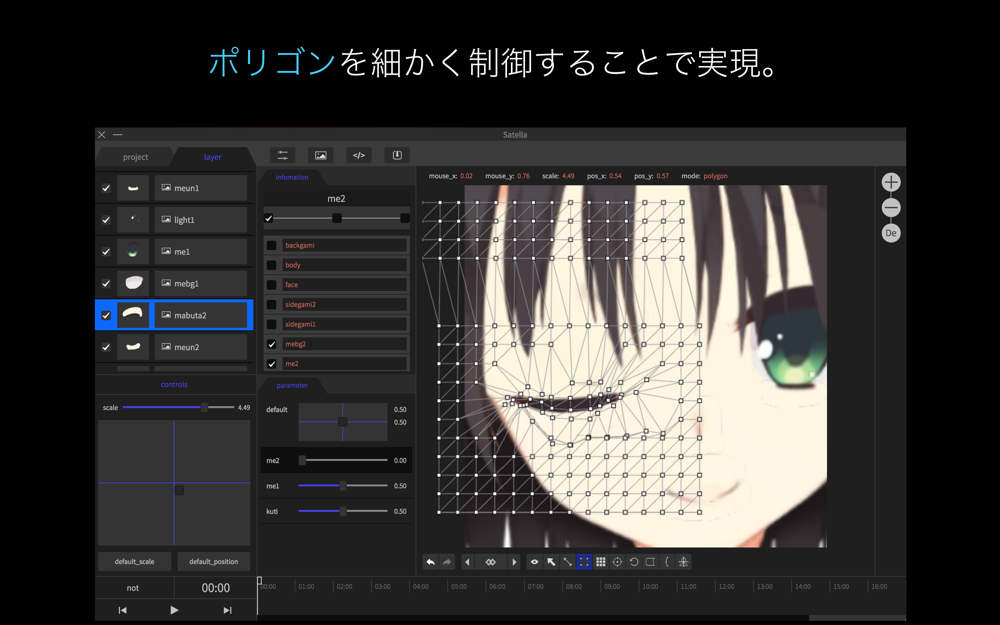
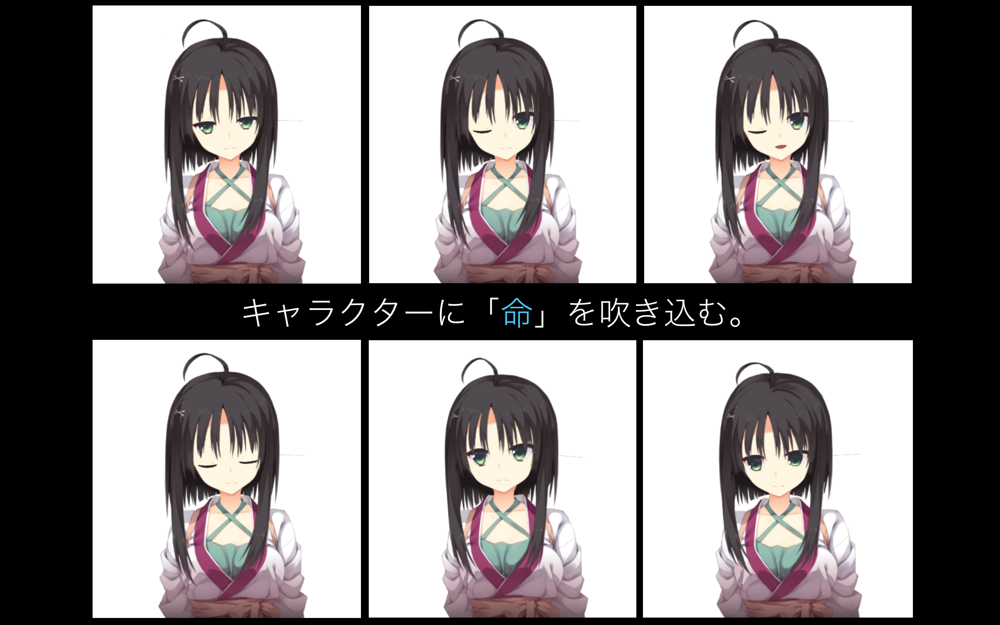

# satella.io
「satella.io」は、Live2Dライクなオープンソースソフトウェアです。
現在、Webサービスとしてブラウザで動作する「satella.pro」を開発中です。
さらなる進化にご期待を。

- satella.ioについての紹介ページ
  - [Qiita - Live2Dライクなオープンソースソフトウェアの開発](http://qiita.com/yuki540/items/87d4f960702672b829b8)
- satella.ioのダウンロード
  - [GitHub - Releases](https://github.com/yuki540net/satella.io/releases/tag/v0.0.1)
- デモ動画
  - [Twitter - 「satella.io」のデモ動画](https://twitter.com/eriri_jp/status/828140972429029376)
- 発表スライド
  - [ニコナレ - Live2Dライクなオープンソースソフトウェアの開発](http://niconare.nicovideo.jp/watch/kn2342)
- 開発者
  - yuki540
  - [Twitter - @eriri_jp](https://twitter.com/eriri_jp)
  - [HP - yuki540.com](http://yuki540.com)

## 「Live2Dライクなオープンソースソフトウェアの開発」という挑戦。

#### オープンソースでないLive2Dような「イラストに命を吹き込む」技術を個人で開発し、オープンソースとして公開することは、私にとってとてもいい経験になりました。

#### 3D技術の知識ゼロから始めたもので、お粗末な出来ですが、誰かにとっての技術的なヒントになることを祈ります。

#### satella.ioは、これから「satella.pro」に改名し、Webサービスとして動作するように開発を進めています。

#### さらなる進化にご期待を。

## ポリゴンを制御することでキャラが動いているように見せる
### 瞬きを表現

### 上下左右の動きを表現

### 複数パターンの動きを生み出す

## satella.ioのこれから
Webブラウザで動作する「satella.pro」にご期待を。

## ライセンスについて
このソフトウェアは、MIT Lisenceのもとで公開されています。
