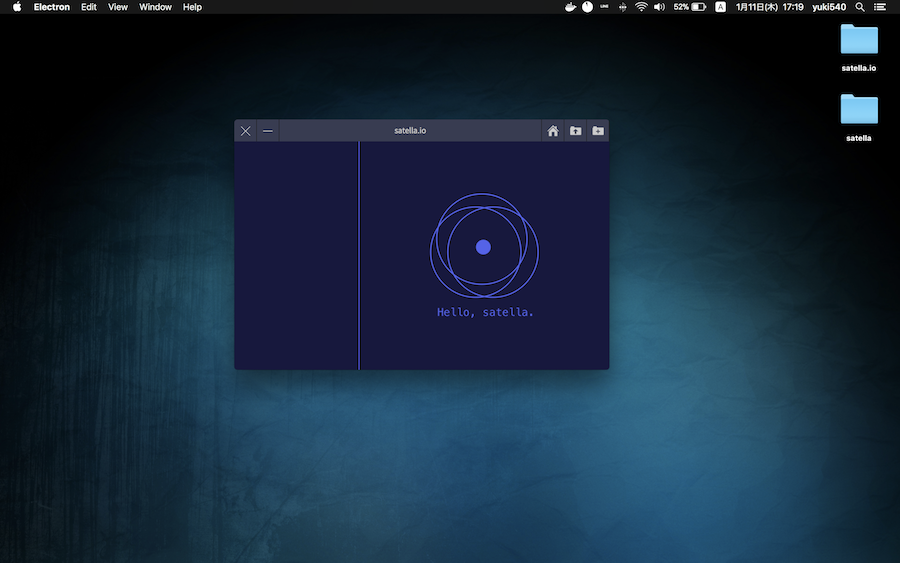

# satella.io
「satella.io」は、イラストに「命」を吹き込むソフトウェアです。

現在、Webサービスとしてブラウザで動作する「[satella.io](http://satella.io)」を開発中です。

2018/02/01に公開予定でしたが、WebGLをきちんと学びなおしたいので公開を延期させていただきます。

できる限り、良いサービスにできるように開発を続けさせていただきます。

※現在公開しているのは、Electron版の過去のバージョンです。

- 開発者
  - yuki540
  - [Twitter - @eriri_jp](https://twitter.com/eriri_jp)
  - [HP - yuki540.com](http://yuki540.com)
  
## 「イラストに命を吹き込む技術のオープンソース化」という挑戦。

「イラストに命を吹き込む」技術を個人で開発し、オープンソースとして公開することは、私にとってとてもいい経験になりました。

3D技術の知識ゼロから始めたもので、お粗末な出来ですが、誰かにとっての技術的なヒントになることを祈ります。

satella.ioは、Webサービスとして動作するように開発を進めています。

#### さらなる進化にご期待を。

## ライセンスについて
このソフトウェアは、MIT Licenseのもとで公開されています。
